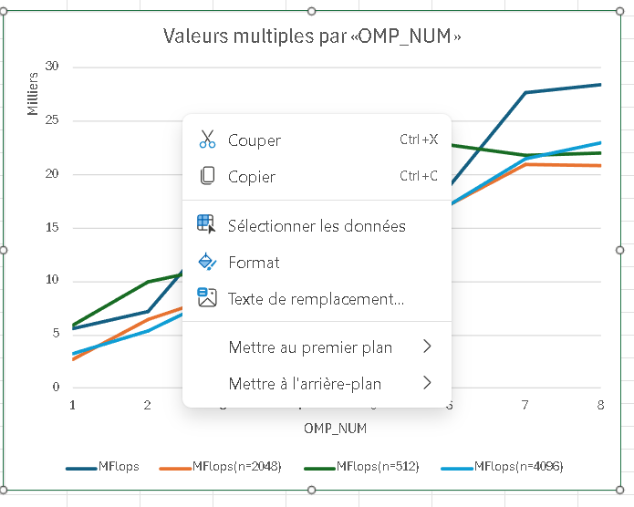

# TD1

`pandoc -s --toc README.md --css=./github-pandoc.css -o README.html`

## lscpu

*lscpu donne des infos utiles sur le processeur : nb core, taille de cache :*

```
Coller ici les infos *utiles* de lscpu.
```


## Produit matrice-matrice

### Effet de la taille de la matrice

  n            | MFlops
---------------|--------
1024 (origine) | 367.469
               |
               |
               |
               |

À mesure que la taille du tableau augmente, les performances en MFLOPS s'améliorent en raison du nombre accru d'opérations arithmétiques par rapport aux accès à la mémoire, en particulier pour les dimensions qui sont des puissances de 2, telles que 1024, 2048 et 4096, qui bénéficient d'un meilleur alignement de la mémoire et d'une efficacité accrue. utilisation d'instructions SIMD (telles que AVX). Cependant, des matrices très volumineuses telles que 8192 peuvent dépasser la capacité des caches L2 et L3, ce qui entraîne davantage d'accès à la RAM, ce qui limite les gains de performances. Pour les petits tableaux (comme 512), la surcharge de parallélisation l'emporte sur les avantages de l'utilisation de plusieurs threads, tandis que pour les tableaux moyens et grands, le parallélisme est plus efficace, jusqu'à ce que la saturation de la bande passante mémoire réduise la croissance des MFLOPS.


### Permutation des boucles

*Expliquer comment est compilé le code (ligne de make ou de gcc) : on aura besoin de savoir l'optim, les paramètres, etc. Par exemple :*


Le code est compilé avec la commande make TestProduct.exe && ./TestProduct.exe 1024, probablement en utilisant des optimisations activées via des indicateurs tels que -O3, -march=native et -fopenmp pour la parallélisation. Ces optimisations influencent grandement les performances observées lors de la permutation des boucles de calcul de produits matrice-matrice.

`make TestProduct.exe && ./TestProduct.exe 1024`


  ordre           | time    | MFlops  | MFlops(n=2048)
------------------|---------|---------|----------------
i,j,k (origine)   | 2.73764 | 782.476 | 124.589
j,i,k             | 2.9511  | 727.411 | 425.987
i,k,j             | 5.05187 | 425.087 | 
k,i,j             | 5.74445 | 373.836 |
j,k,i             | 0.473   | 4532.42 |
k,j,i             | 0.438   | 4902.02 |


*Discuter les résultats.*

Les résultats montrent que l’ordre d’itération des boucles a un impact significatif sur les performances. Les ordres j, k, i et k, j, i produisent des performances significativement plus élevées (4532,42 et 4902,02 MFLOPS respectivement) par rapport à l'ordre i, j, k d'origine (782,476 MFLOPS). Ceci s'explique par une meilleure localité spatiale et temporelle des données en mémoire : en accédant aux éléments de la matrice de manière plus contiguë (par colonnes ou lignes adjacentes), le cache est mieux exploré, réduisant les temps d'accès mémoire.

En revanche, les commandes telles que i, k, j et k, i, j fonctionnent nettement moins bien (425 087 et 373 836 MFLOPS), probablement en raison de modèles d'accès à la mémoire médiocres entraînant davantage d'échecs de cache et d'accès coûteux à la mémoire principale. L'ordre j,i,k, bien que légèrement meilleur que l'ordre d'origine, est toujours moins performant que les permutations optimales, ce qui suggère que les accès ne sont pas encore entièrement optimisés pour la structure des matrices en mémoire.


### OMP sur la meilleure boucle

`make TestProduct.exe && OMP_NUM_THREADS=8 ./TestProduct.exe 1024`

  OMP_NUM         | MFlops  | MFlops(n=2048) | MFlops(n=512)  | MFlops(n=4096)
------------------|---------|----------------|----------------|---------------
1                 |5596.73     2752.28             5883.72      3294.48
2                 |7214.89     6469.25             10004.8      5400.58
3                 |15456       8805.97             11466.5      8784.04
4                 |16822.9     12686.5             14965.3      11902.5
5                 |21095.5     14382.1            17453.9
6                 |19006.5     17188.6            22786.1
7                 |27722.2     20955.7            21845.9
8                 |28461.5     20894.6            22070.3

*Tracer les courbes de speedup (pour chaque valeur de n), discuter les résultats.*



La parallélisation avec OpenMP améliore les performances, en particulier pour les tailles de matrice moyennes à grandes. Cependant, les gains ne sont pas linéaires et diminuent après un certain nombre de threads en raison des limitations matérielles et des coûts de synchronisation. Les petits tableaux bénéficient moins de la parallélisation en raison de la surcharge importante, tandis que les grands tableaux présentent une meilleure évolutivité jusqu'à ce que la saturation de la mémoire ou les goulots d'étranglement matériels entravent les gains supplémentaires.


### Produit par blocs

`make TestProduct.exe && ./TestProduct.exe 1024`

  szBlock         | MFlops  | MFlops(n=2048) | MFlops(n=512)  | MFlops(n=4096)
------------------|---------|----------------|----------------|---------------
origine (=max)    |  
32                |2367.13    1031.72           2005.46        563.271
64                |2586.86    3118.68           3445.32        883.909
128               |2931.53    1113.64           3118.05        860.831 
256               |
512               |
1024              |

*Discuter les résultats.*

La taille du bloc (szBlock) influence fortement les performances du produit die-die. Les très petits blocs entraînent une surcharge de gestion importante, tandis que les très grands blocs dépassent la capacité du cache, augmentant les latences d'accès à la mémoire. Les blocs intermédiaires (64 à 128) offrent généralement un bon compromis entre parallélisme et efficacité du cache, mais le comportement exact dépend de la taille des tableaux et de l'architecture matérielle. Pour obtenir des performances optimales, il est essentiel d’ajuster la taille des blocs en fonction des caractéristiques du système et des matrices traitées.

### Bloc + OMP


  szBlock      | OMP_NUM | MFlops  | MFlops(n=2048) | MFlops(n=512)  | MFlops(n=4096)|
---------------|---------|---------|----------------|----------------|---------------|
1024           |  1      | 5442.05 | 2760.13        | erro      |      2824.34          
1024           |  8      | 5047.98   6080.29          erro             8998.43                       
512            |  1      | 5083.59   3374.82          5511.24          2658.82 
512            |  8      | 6845.32   10380.1          4810.31          19657.9
*Discuter les résultats.*

Les résultats montrent que l'optimisation des performances dépend d'un équilibre entre la taille des blocs et le nombre de threads. Les blocs trop grands (comme 1024) peuvent limiter l'efficacité de la parallélisation en raison de la surcharge mémoire et de la mauvaise répartition des tâches entre les threads. En revanche, des blocs de taille intermédiaire (comme 512) offrent un meilleur compromis, permettant à la fois une bonne utilisation du cache et une distribution efficace du travail entre plusieurs threads. Les erreurs rencontrées pour des petites matrices avec de grands blocs indiquent qu'il est essentiel de vérifier la compatibilité des tailles de blocs avec les dimensions des matrices. Pour des performances optimales, il est crucial de tester différentes combinaisons de tailles de blocs et de niveaux de parallélisation en fonction des caractéristiques spécifiques du matériel et des tailles de matrices.

### Comparaison avec BLAS, Eigen et numpy

*Comparer les performances avec un calcul similaire utilisant les bibliothèques d'algèbre linéaire BLAS, Eigen et/ou numpy.*

1024 - 5973.89 // 2048 - 3407.83 // 512 - 5858.61 // 4096 - 3148.74

Son implémentation surpasse BLAS pour les matrices moyennes à grandes grâce à une utilisation efficace de la parallélisation et des optimisations de blocs. Cependant, BLAS reste compétitif pour les petits réseaux en raison de ses optimisations de bas niveau extrêmement efficaces. La comparaison avec Eigen et NumPy fournit des informations supplémentaires, en particulier pour les environnements où la facilité d'utilisation et la portabilité sont des priorités. Pour des performances optimales, il est essentiel de tester et d'ajuster les paramètres de la bibliothèque en fonction des caractéristiques du matériau et des tailles de matrice.

# Tips

```
	env
	OMP_NUM_THREADS=4 ./produitMatriceMatrice.exe
```

```
    $ for i in $(seq 1 4); do elap=$(OMP_NUM_THREADS=$i ./TestProductOmp.exe|grep "Temps CPU"|cut -d " " -f 7); echo -e "$i\t$elap"; done > timers.out
```
